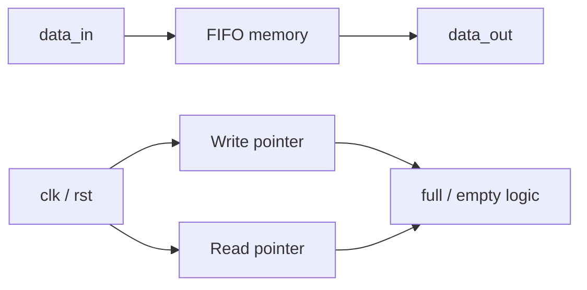
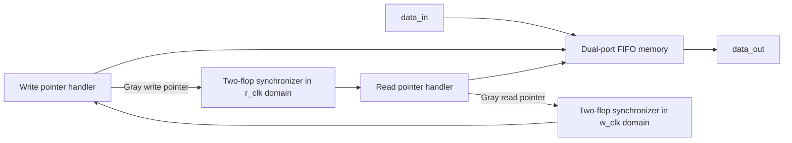

# Architecture and design notes

## FIFO fundamentals

A FIFO preserves the order of accepted writes: the first word written is the first word later read. A FIFO must prevent a write when full and a read when empty. Both designs in this repository use registered reads, so a successful read updates `data_out` after the active clock edge.

## Synchronous FIFO

`fifo_sync` is a single-clock FIFO. Its storage, read pointer, and write pointer are all clocked by `clk`.

The module uses four-bit pointers. The lower three bits select one of eight memory locations; the upper bit distinguishes wrapped from non-wrapped pointer states. `empty` is asserted when the pointers match. `full` is asserted when the address bits match and the pointer wrap bits differ.

### Current parameterization limitation

The RTL declares `DEPTH` and `DATA_WIDTH`, but `wr_pointer`, `rd_pointer`, and their `[2:0]` memory addressing are fixed width. Consequently, the verified configuration is `DEPTH = 8`; only `DATA_WIDTH` is fully parameterized. To make depth genuinely configurable, derive the address width with `$clog2(DEPTH)`, use pointers that are one bit wider, and replace the fixed slices and flag expressions accordingly.

## Asynchronous FIFO

The asynchronous FIFO transfers data between independent write (`w_clk`) and read (`r_clk`) clock domains. It is arranged as four cooperating blocks:

### Pointer and CDC strategy

Each domain owns its binary pointer, which addresses memory locally. The pointer is also Gray encoded using `gray = binary ^ (binary >> 1)`. Only the Gray pointer crosses clock domains, where it passes through a two-register synchronizer. Gray coding limits an increment to one changing bit, reducing the risk of an incoherent multi-bit value being sampled during a clock-domain crossing.

- `writeptr_handler` advances the write pointer only for `wr_en && !full`, then calculates the next `full` state using the synchronized read pointer.
- `readptr_handler` advances the read pointer only for `r_en && !empty`, then calculates the next `empty` state using the synchronized write pointer.
- `fifo_memory` has separate write and read processes, addressing the memory with the low pointer bits.

The full comparison inverts the two most-significant Gray bits of the synchronized read pointer. This form assumes a power-of-two FIFO depth. The present expression selects `ADDRESS_WIDTH-2:0`, so `FIFO_DEPTH` must yield `ADDRESS_WIDTH >= 2` (depth of 4 or more).

### Reset and startup

The asynchronous blocks use independent active-low asynchronous resets. Assert both resets before operation and deassert them cleanly for the target implementation. The read-pointer handler currently resets `empty` to `0`; after the reset is released it becomes `1` only when the next `r_clk` edge evaluates the equal synchronized pointers. Downstream logic should therefore wait for reset release and flag convergence before issuing reads.

## Integration guidance

- Constrain the asynchronous FIFO's clock domains and CDC paths according to the target tool flow. The two-flop synchronizer registers should be preserved and recognized as CDC registers.
- Do not infer any ordering between `w_clk` and `r_clk`.
- Treat `full` as authoritative in the write domain and `empty` as authoritative in the read domain; synchronization latency means status changes are intentionally delayed across domains.
- For FPGA targets, inspect synthesis reports to confirm that the memory style and independent ports map as intended.
